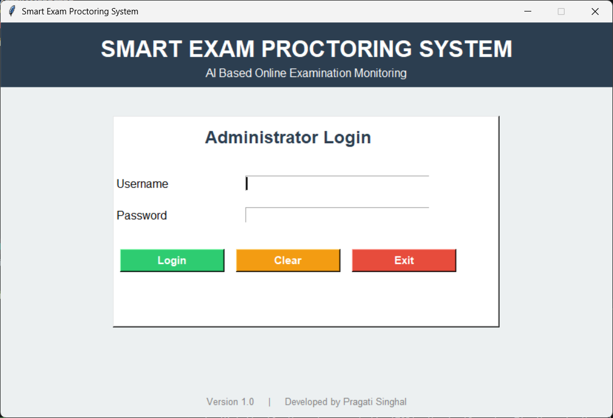
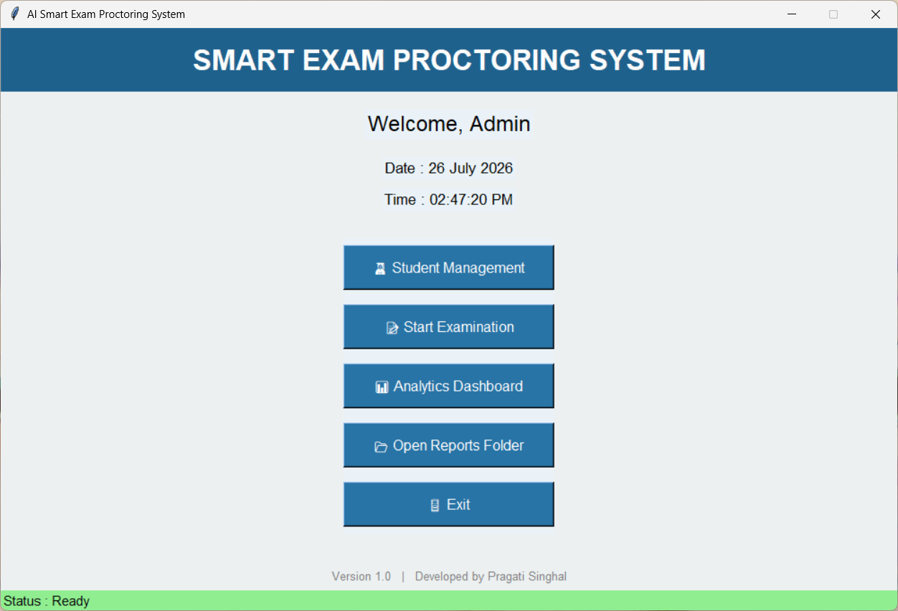
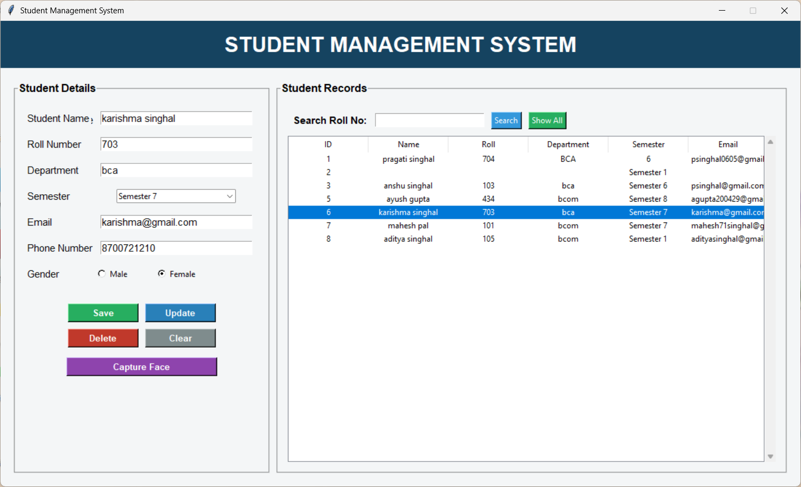
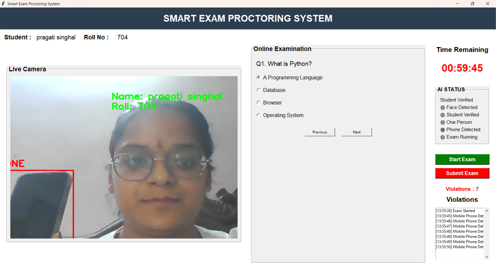
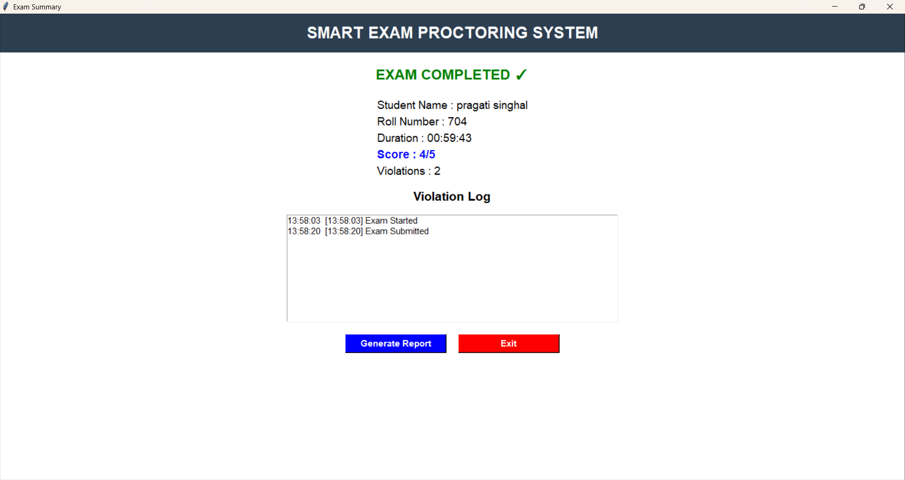
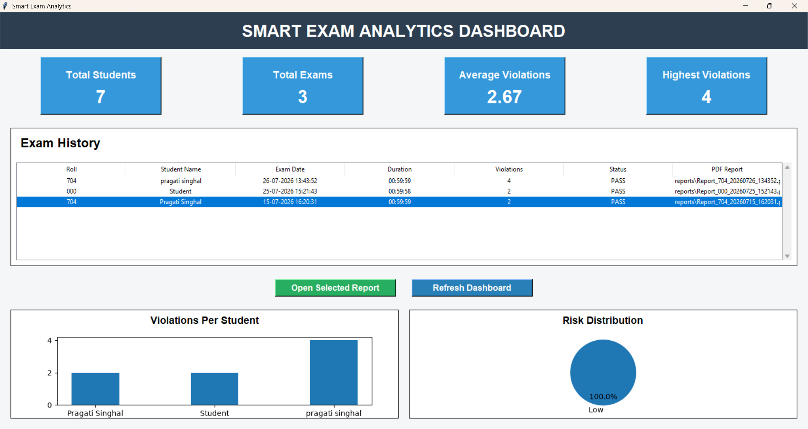
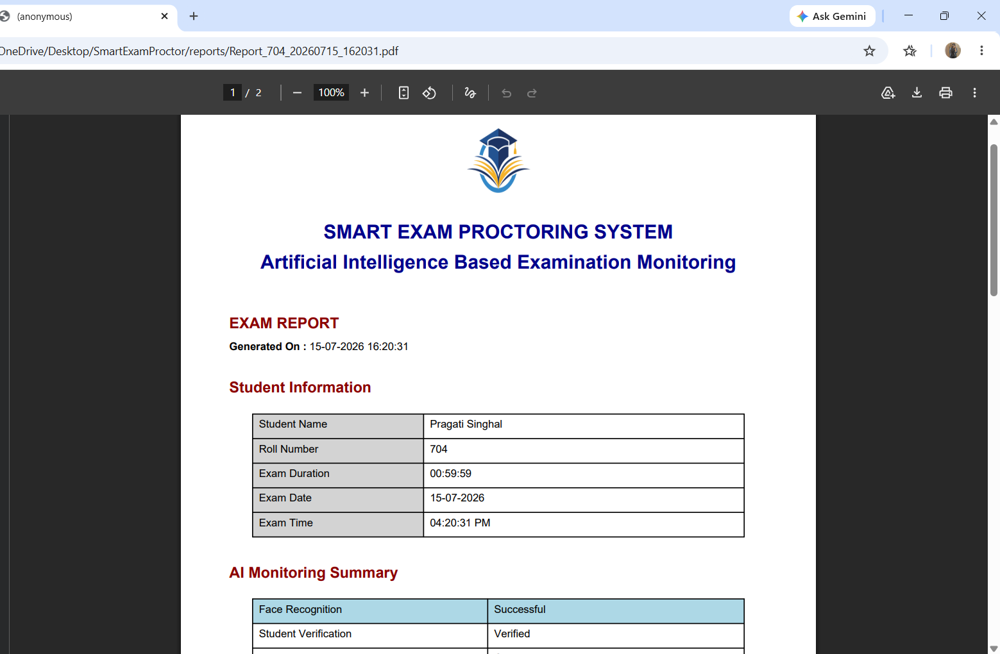
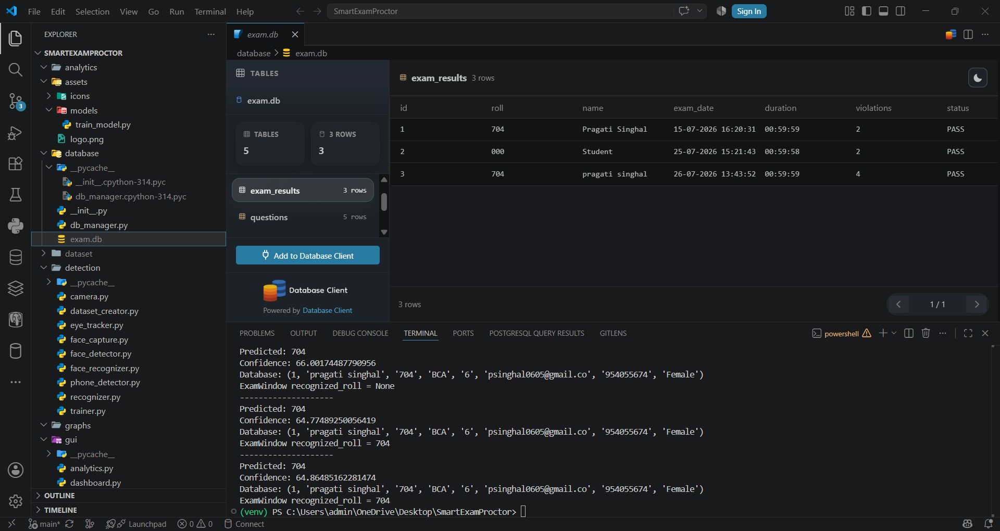
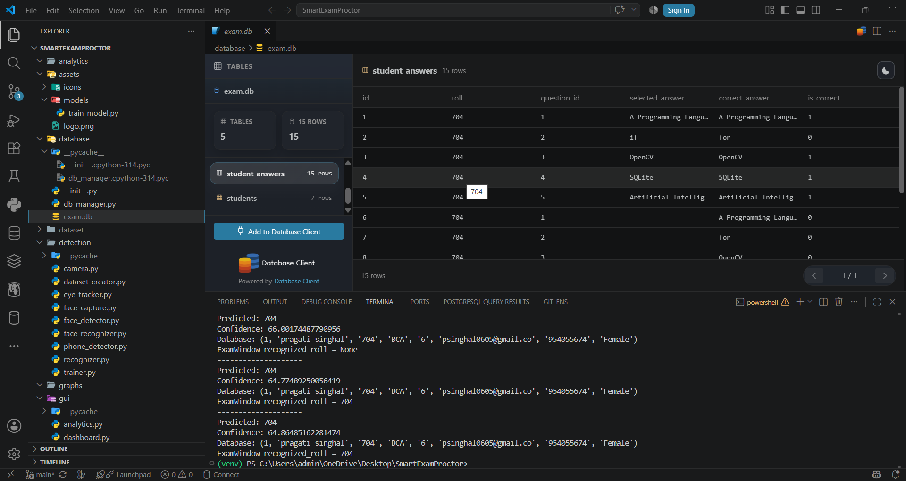

# 🎓 Smart Exam Proctor

An AI-powered Smart Exam Proctoring System developed using Python, OpenCV, Face Recognition, Tkinter, and SQLite. The system helps monitor online examinations by verifying student identity and detecting suspicious activities.

---

# 🚀 Features

- Student Registration
- Face Dataset Collection
- Face Recognition
- Live Camera Monitoring
- Student Authentication
- Multiple Person Detection 
- AI-based Exam Monitoring
- SQLite Database Management
- Attendance Logging
- User-Friendly GUI

---

# 🛠 Technologies Used

- Python
- OpenCV
- Tkinter
- SQLite
- NumPy
- Pillow

---

# 📁 Project Structure

```
SmartExamProctor/
│
├── assets/
├── database/
├── detection/
├── gui/
├── models/
├── reports/
├── utils/
├── main.py
├── requirements.txt
└── README.md
```

---

# ⚙ Installation

Clone the repository

```bash
git clone https://github.com/puser-p/SmartExamProctor.git
```

Go into the project folder

```bash
cd SmartExamProctor
```

Install dependencies

```bash
pip install -r requirements.txt
```

Run the project

```bash
python main.py
```

---

# 📸 Project Screenshots

## 🔐 Login Page

The login page provides secure access to the Smart Exam Proctoring System. Only authorized users can log in and access the application.



---

## 📈 Dashboard

The main dashboard acts as the central control panel of the application, providing quick access to different modules such as student management, examination, reports, and analytics.



---

## 📋 Student Management

This module allows administrators to register, update, delete, and manage student records. It also stores student information in the SQLite database.



---

## 📝 Online Exam Window

The exam interface where students take the examination. During the exam, AI continuously monitors the candidate through the webcam to maintain exam integrity.



---

## 📤 Exam Submission

After completing the examination, students can securely submit their answers. The system records the submission and updates the database automatically.



---

## 📊 Analytics Dashboard

The analytics dashboard provides graphical insights into examination data, student performance, attendance, and other important statistics.



---

## 📑 Reports

The reports module generates examination reports, attendance records, and other useful information that can be viewed or exported by the administrator.



---

## 🗄️ Exam Results Database

This screenshot shows the database storing students' examination results, helping maintain accurate records for evaluation and future reference.



---

## 🗄️ Student Answers Database

This database stores the answers submitted by students during examinations for result processing and verification.



# 📌 Future Improvements

- Eye Tracking
- Head Pose Detection

- Cloud Database
- Web Dashboard
- AI-Based Cheating Detection

---

# 👩‍💻 Author

**Pragati Singhal**

GitHub: https://github.com/puser-p
